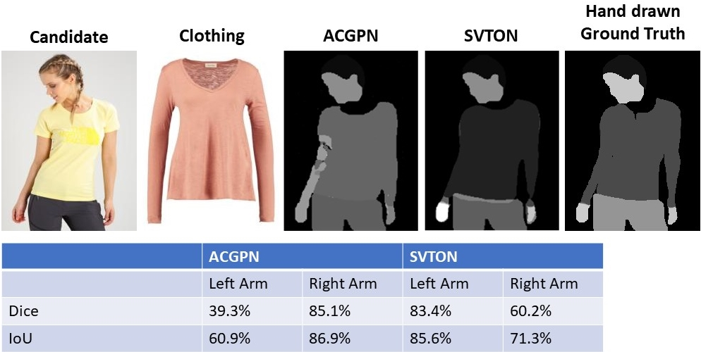
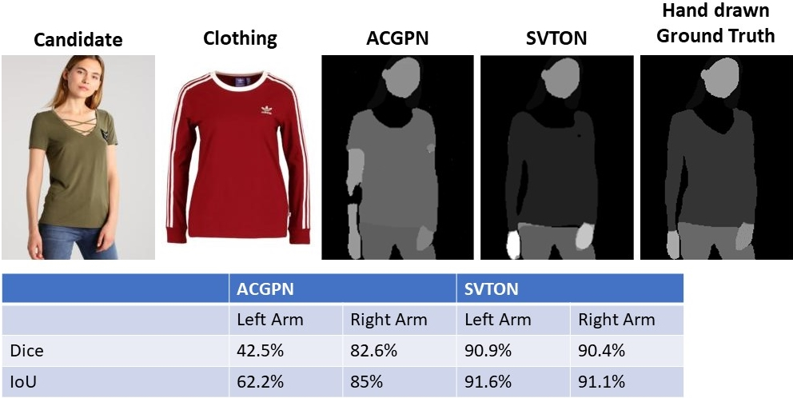
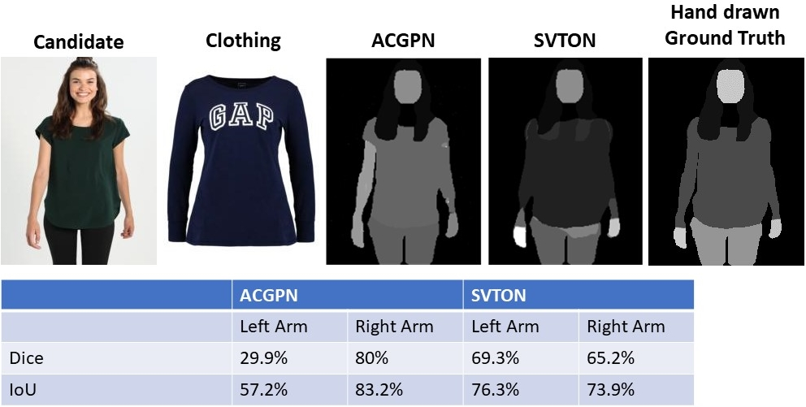

<div id="top"></div>

<h3> SVTON: SIMPLIFIED VIRTUAL TRY-ON</h3>

<p>
This repository has the official code for 'SVTON: SIMPLIFIED VIRTUAL TRY-ON'. 
We have included the pre-trained checkpoint, dataset and results.   
</p>

### Prerequisites
Download the pre-trained checkpoints and dataset: 
[[Pre-trained checkpoints]](https://www.dropbox.com/s/yveeid5i57jlwut/checkpoints.zip?dl=0) 
[[Dataset]](https://www.dropbox.com/s/8nl54f3uzf5p6zi/SVTON_DATASET.zip?dl=0)
 
Extract the files and place them in the checkpoint and data directory
<!-- GETTING STARTED -->
## Getting Started
To run the inference of our model, execute ```python3 run_inference.py```

We recommend creating a virtual environment using venv or conda.  

If using conda on Windows:
```
conda create --name [ENV_NAME] python=3.9
conda activate [ENV_NAME]
pip3 install torch==1.10.2+cu113 torchvision==0.11.3+cu113 torchaudio===0.10.2+cu113 -f https://download.pytorch.org/whl/cu113/torch_stable.html
pip install
```
<!-- GETTING STARTED -->
## Getting Started

To run the inference of our model, execute ```python3 run_inference.py```


<!-- Results -->
## Results


We have used Dice and IoU to evaluate our segmentation performance. The ground truth image had to be hand-drawn. 




