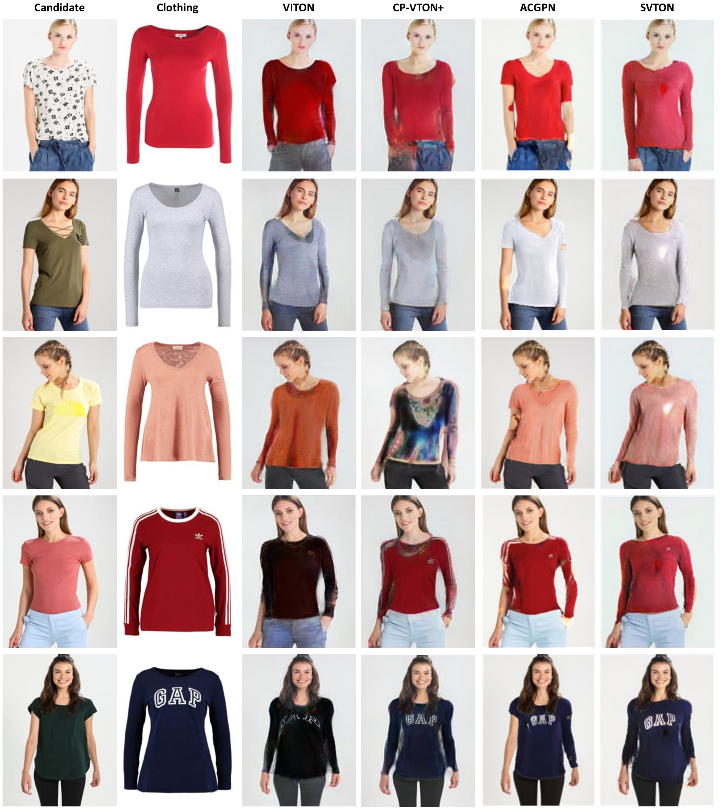

<div id="top"></div>

<h3> SVTON: SIMPLIFIED VIRTUAL TRY-ON</h3>

<p>
This repository has the official code for 'SVTON: SIMPLIFIED VIRTUAL TRY-ON'. 
We have included the pre-trained checkpoint, dataset and results.   
</p>

### Prerequisites
Download the pre-trained checkpoints and dataset: 
[[Pre-trained checkpoints]](https://www.dropbox.com/s/oz1ypn9aeeblagj/checkpoints.zip?dl=0) 
[[Dataset]](https://www.dropbox.com/s/8nl54f3uzf5p6zi/SVTON_DATASET.zip?dl=0)
 
Extract the files and place them in the ```checkpoint``` and ```data``` directory
<!-- INSTALLATION -->
## Installation
To run the inference of our model, execute ```python3 run_inference.py```

We recommend creating a virtual environment using venv or conda.  

If using conda on Windows:
```
conda create --name [ENV_NAME] python=3.9
conda activate [ENV_NAME]
pip install torch==1.10.2+cu113 torchvision==0.11.3+cu113 torchaudio===0.10.2+cu113 -f https://download.pytorch.org/whl/cu113/torch_stable.html
pip install -r requirements.txt
```
<!-- GETTING STARTED -->
## Getting Started
Modify the ```data/custom.txt``` to select the pair of the candidate and target clothing. <br>
To run the inference of our model, execute ```python3 run_inference.py```

To train, run ```python3 train_[phpm/gmm/tom]``` and the checkpoint will be saved periodically in the ```checkpoint_[phpm/gmm/tom]``` directory.

<!-- Model Overview -->
## Model Overview


<!-- Results -->
## Results


We have used Dice and IoU to evaluate our segmentation performance. The ground truth image had to be hand-drawn. 


<!-- Negative Results -->
## Negative Result

The segmentation module can generate a torso that is either too big or small. The example below shows the torso not connecting with the lower body. The binary mask does not provide information about where the boundary is between the upper and lower body. The segmentation module can find it challenging to generate the torso label with the correct size.  


